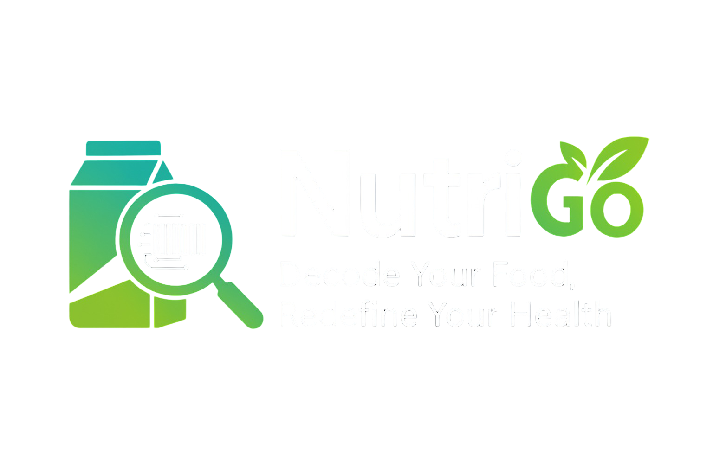

<div align="center">



### Smart Packaged Food Scanning Made Simple

**Stop guessing what's in your packaged foods.** Instantly scan packaged products with AI-powered precision to reveal hidden sugars, calories, and ingredients. Make informed choices in seconds.

[](https://nutrigo-kappa.vercel.app/)
[](https://github.com/tung-programming/nutrigo)
[](LICENSE)

[🚀 Live Demo](https://nutrigo-kappa.vercel.app/) · [🐛 Report Bug](https://github.com/tung-programming/nutrigo/issues) · [✨ Request Feature](https://github.com/tung-programming/nutrigo/issues)

</div>

---

## 📋 Table of Contents

- [🎯 About the Project](#-about-the-project)
- [✨ Features](#-features)
- [🍟 Supported Packaged Food Categories](#-supported-packaged-food-categories)
- [🛠️ Tech Stack](#-tech-stack)
- [📂 Project Structure](#-project-structure)
- [🏗️ Architecture & API Reference](#-architecture--api-reference)
- [🚀 Getting Started](#-getting-started)
- [💻 Usage](#-usage)
- [📱 Dashboard Features](#-dashboard-features)
- [🤖 AI-Powered Tools](#-ai-powered-tools)
- [🐳 Docker & Deployment](#-docker--deployment)
- [👥 Our Team](#-our-team)
- [📄 License](#-license)
- [📞 Contact & Support](#-contact--support)

---

## 🎯 About the Project

**NutriGo** is India's AI-powered nutrition companion, revolutionizing how people understand packaged foods. In a world where food labels confuse more than they clarify, we bring clarity through intelligent technology.

### Our Mission
To democratize nutrition knowledge through AI-powered technology, empowering every Indian to make informed food choices that improve their health and well-being.

### Our Vision
A future where food transparency is the norm. Where every Indian has instant access to clear, reliable nutrition information that helps them live healthier lives.

### Why NutriGo?
- **101 million** Indians living with diabetes
- **Rising childhood obesity** rates across the country
- **Confusing food labels** that lack transparency
- **Need for instant, reliable** nutrition insights

---

## ✨ Features

### 🔍 **AI-Powered Scanner**
Instantly scan any packaged food product with advanced AI to decode:
- Scan chips, biscuits, breakfast cereals, snacks, and beverages
- Identify sugar levels and hidden additives in processed foods
- Get calorie breakdown and complete nutritional values
- Analyze all ingredients and detect allergens
- Works with Indian packaged brands like Lay's, ITC, Britannia, Amul, and more

### 🎯 **Smart Health Score**
Every packaged product gets an intelligent Health Score (0-100):
- Comprehensive analysis of sugar content in snacks and beverages
- Calorie density assessment for portion planning
- Additive and preservative detection with warnings
- Overall healthiness rating for instant comparison
- Perfect for comparing products like Maggi, Haldiram's, Cadbury, and local brands

### 🌱 **Better Alternatives**
Discover healthier packaged food substitutes instantly:
- Find healthier alternatives for favorite snacks and breakfast items
- Compare popular products: Lay's vs Baked Chips, Regular Cookies vs Oats Cookies
- See nutritional differences at a glance
- Browse curated healthy options from brands like Yoga Bar, Slurrp Farm, Nature's Path
- Integration with major e-commerce platforms (Blinkit, Zepto, Swiggy, BigBasket)

### 📈 **Progress Tracking**
Monitor your nutrition journey with detailed analytics:
- Track your packaged food consumption patterns
- Personalized recommendations based on scanning history
- AI-driven insights from your dietary choices with real products
- Weekly and monthly nutrition analytics for packaged foods
- Visual progress charts and statistics showing improvement

### ⚡ **Instant Analysis**
Get real-time nutrition breakdown in milliseconds:
- Scan packaged products and get results instantly
- Lightning-fast AI processing of food labels
- Complex nutritional data analyzed in seconds
- Immediate actionable insights for better choices
- No waiting, instant results for busy lifestyles

### 🤖 **Smart AI Chatbot**
Ask questions about packaged foods, nutrition, and ingredients:
- Ask "Is Maggi noodles healthy?" - Get instant analysis
- "What's in this snack?" - AI decodes all ingredients
- 24/7 instant AI-powered answers and recommendations
- Voice input support (speech-to-text) for hands-free queries
- Voice output support (text-to-speech) for audio responses
- Conversational AI that understands your dietary goals

### 🎨 **Beautiful Dashboard**
Comprehensive user dashboard featuring:
- See your recent packaged food scans at a glance
- Nutrition statistics from all your scanned products
- Health trends visualization based on packaged foods
- Quick access to all scanning and comparison features
- Responsive design that works on all devices

### 💾 **Scan History**
Keep track of everything you've scanned:
- Complete history of all packaged food products scanned
- Date, time, and details of each scan
- Product names, brands (Britannia, ITC, Lay's, etc.), and health scores
- Quick re-access to previous packaged food analyses
- Easy search and filter capabilities

### ⭐ **Favorites Management**
Create your personal collection of packaged foods:
- Save favorite healthy packaged products you like
- Save unhealthy products to remember what to avoid
- Quick access to frequently checked packaged items
- Organize by category (snacks, cereals, beverages, etc.)
- Track trending healthy packaged options

### 🔐 **User Authentication**
Secure and easy account management:
- Sign up and login with email/password
- **Google OAuth** one-click sign-in integration
- User profile management (name, phone, location, bio)
- Supabase Auth with session refresh middleware
- Protected routes — middleware redirects unauthenticated users to login
- JWT-based backend authentication with bcrypt password hashing
- Privacy-first approach to your health data

### 🔄 **Product Comparisons**
Compare packaged products side-by-side:
- Compare similar products: Britannia Cookies vs Sunfeast Cookies
- View nutritional comparison charts instantly
- See health score differences at a glance
- Analyze ingredient variations between brands
- Find the best packaged option for your dietary needs

### 📊 **Analytics Dashboard**
Advanced analytics for premium users:
- Daily, weekly, monthly nutrition trends from packaged foods
- Health goal progress tracking based on your scans
- Detailed nutrient breakdowns (proteins, fats, carbs, sugars)
- Personalized health insights and recommendations
- Export reports of your nutrition journey

### 🎯 **Health Goals**
Set and track personal health objectives:
- Customizable health goals
- Goal progress visualization
- AI recommendations aligned with goals
- Success tracking

### 📱 **Responsive Design**
Seamless experience across all devices:
- Mobile-optimized interface with touch-friendly controls
- Tablet compatibility with adaptive layouts
- Desktop full experience with sidebar navigation
- **Framer Motion** animations and smooth transitions
- Floating navbar with scroll-aware transparency

### 🌗 **Dark/Light Theme**
Full theme support powered by `next-themes`:
- Dark mode by default with rich gradient backgrounds
- Light mode support via theme toggle
- System preference detection
- Persistent theme preference across sessions

### 🎭 **Animated Login Experience**
Interactive and delightful authentication pages:
- Animated mascot that follows your cursor on the login page
- Mascot covers its eyes when you type your password
- Happy expression on successful login
- Starfield background animation with 60 animated stars
- Google OAuth button with animated icon
- Remember Me functionality

---

## 🍟 Supported Packaged Food Categories

NutriGo scans and analyzes products across all major Indian packaged food categories:

- 🍟 **Snacks & Chips** — Lay's, Bingo, Kurkure, Cheetos, Makhana, Popcorn
- 🍪 **Biscuits & Cookies** — Britannia, ITC, Sunfeast, Oreo, Parle-G
- 🥣 **Breakfast Cereals** — Kellogg's, Quaker Oats, Bagrry's, Muesli, Granola
- 🍜 **Noodles & Pasta** — Maggi, Yippee, Top Ramen, Pasta, Vermicelli
- 🧂 **Instant Mixes** — Dosa mix, Idli mix, Upma mix, Dhokla mix
- 🍫 **Chocolates & Sweets** — Cadbury, Nestlé, Amul, KitKat, Dairy Milk
- 🥛 **Beverages** — Tropicana, Real, Coca-Cola, Pepsi, Frooti, Paper Boat
- 🥛 **Dairy** — Amul, Mother Dairy, Paneer, Cheese, Yogurt, Ghee
- 🍯 **Spreads & Jams** — Peanut Butter, Nutella, Kissan, Honey
- 🍞 **Bread** — Sliced bread, Pav, Buns, Sandwich bread
- 🧊 **Frozen Foods** — Paratha, Samosa, Spring Roll, Nuggets
- 🥒 **Pickles** — Priya, Mother's Recipe, Patanjali
- 🥫 **Condiments** — Ketchup, Sauce, Mayonnaise, Chutney, Masala
- 💪 **Health Drinks** — Horlicks, Bournvita, Boost, Complan, Protinex
- 🥜 **Nuts & Dry Fruits** — Happilo, Farmley, Trail Mix, Roasted Makhana
- 🌾 **Grains & Flour** — Rice, Wheat, Atta, Quinoa, Ragi, Jowar
- 💊 **Protein & Health Products** — Yoga Bar, Slurrp Farm, Whey Protein

Each product is analyzed for optimal nutrition and health impact!

### 📥 **PDF Export & Sharing**
Download and share scan results and comparisons:
- Export scan results as professional PDF reports (jsPDF + html2canvas)
- Export side-by-side product comparisons as landscape PDFs
- Share results via Web Share API or clipboard
- Generate shareable comparison summary text
- Dark-themed PDF reports with A4 formatting and multi-page support

### 🗣️ **Voice Interaction (TTS & STT)**
Full voice support powered by Sarvam AI and Web Speech API:
- **Text-to-Speech**: Sarvam AI (`bulbul:v1` model) with Indian English voice (`vidya` speaker)
- **Speech-to-Text**: WebKit Speech Recognition for hands-free chatbot input
- Browser-based TTS fallback when Sarvam API is unavailable
- RecordRTC integration for audio recording capabilities
- Real-time interim transcript display during voice input

### 🔬 **Advanced Health Score Engine**
Category-specific scoring with transparent breakdown:
- **8 specialized scoring algorithms**: Beverage, Snack, Dairy, Packaged Food, Breakfast Cereal, Frozen Food, Condiment, Dessert
- Detailed score breakdown showing penalties and bonuses with reasons
- Score interpretation: Excellent (85+), Good (70+), Moderate (50+), Poor (30+), Very Poor (<30)
- Confidence adjustment based on data completeness
- Per-100g normalization for fair comparison

### 🤖 **Multi-Layer Food Recognition Pipeline**
Intelligent 4-step product identification:
1. **Tesseract.js OCR** — Extract barcode numbers and text from images
2. **OpenFoodFacts API** — Barcode lookup against global food database
3. **OpenFoodFacts Text Search** — Fallback search by product name
4. **Gemini 2.5 Flash Vision** — AI-powered image analysis with nutrition prediction when labels aren't visible

### 🏷️ **Smart Category Detection**
Automatic product categorization with subcategory support:
- Detects 15+ categories: snacks, biscuits, beverages, sweets, dairy, grains, proteins, noodles, cereal, condiments, frozen, pickles, bread, spreads, health drinks, instant mixes
- Subcategory detection (e.g., chips → chips/namkeen/popcorn, biscuits → cream/digestive/cookies)
- Both frontend and backend implementations with regex-based pattern matching

### 🛒 **Quick Commerce Integration**
Direct purchase links to India's top delivery platforms:
- **Blinkit** — 10-20 minute delivery links
- **Zepto** — Ultra-fast delivery links
- **Swiggy Instamart** — Quick grocery delivery links
- **BigBasket** — Online grocery delivery links
- Auto-generated search URLs for every alternative product

### 💰 **Pricing & Subscription Tiers**
Three-tier pricing model with yearly discounts:
- **NutriGo (Free)** — 5 scans/day, basic health score, food comparisons
- **NutriPlus (₹249/mo)** — Unlimited scans, detailed nutrients, AI insights, weekly reports, no ads
- **NutriPro (₹499/mo)** — Everything in Plus + health goals, advanced analytics, hydration tracker, expert consultation
- Monthly/yearly billing toggle with 17% yearly savings

### 🧠 **CatBoost ML Model**
Machine learning health score prediction:
- CatBoost Regressor trained on `Indian_Packaged_Food.csv` dataset
- Feature engineering: protein-to-calorie ratio, fat-to-calorie ratio, sugar-to-carb ratio, macronutrient balance, calorie density
- RobustScaler normalization with 3-fold cross-validation
- Model artifacts: `health_score_catboost_model.pkl`, `health_score_scaler.pkl`, `feature_columns.pkl`

### 📊 **Dashboard Analytics**
Rich data visualization with Recharts:
- Weekly scan activity bar charts
- Health score trend line charts
- Streak tracking (consecutive days of scanning)
- Healthy choices percentage calculation
- Average health score aggregation

### 🍽️ **Meal Tracking**
Food record management by meal type:
- Track scans by meal: breakfast, lunch, dinner, snack
- Servings count per food record
- Notes per scan entry
- Aggregated average health score over configurable time periods (30-day default)
- Indexed queries by user + meal type + date for fast lookups

### 🔔 **Toast Notifications**
Real-time feedback via Sonner toast system:
- Success/error/info toast notifications across all actions
- Scan saved, favorite toggled, PDF downloaded, profile updated confirmations
- Auto-dismiss toasts with smooth animations
- Global Toaster component on all dashboard pages

### 🧩 **50+ UI Components**
Comprehensive component library built on Radix UI + shadcn/ui:
- Accordion, Alert Dialog, Avatar, Badge, Breadcrumb, Button, Calendar
- Card, Carousel, Chart, Checkbox, Collapsible, Command Palette
- Context Menu, Dialog, Drawer, Dropdown Menu, Form, Hover Card
- Input, Input OTP, Label, Menubar, Navigation Menu, Pagination
- Popover, Progress, Radio Group, Resizable Panels, Scroll Area
- Select, Sheet, Sidebar, Skeleton, Slider, Switch, Table, Tabs
- Textarea, Toast, Toggle, Tooltip, and more

---

## 🛠️ Tech Stack

### Frontend
- **Next.js 16+** — React framework with App Router
- **TypeScript** — Type-safe development
- **Tailwind CSS v4** — Utility-first styling
- **Radix UI** — Full accessible component library (50+ components)
- **Recharts** — Data visualization (bar/line charts)
- **React Hook Form + Zod** — Form management with schema validation
- **Framer Motion** — Smooth animations and transitions
- **jsPDF + html2canvas** — PDF generation from DOM
- **Vercel Analytics** — Production analytics
- **Sonner** — Toast notification system
- **Lucide React** — Icon library
- **date-fns** — Date manipulation
- **cmdk** — Command palette component
- **next-themes** — Dark/Light theme system with system preference detection
- **RecordRTC** — Audio recording capabilities for voice input

### Backend
- **Express.js** — Node.js web framework with TypeScript
- **Tesseract.js** — OCR text recognition from food label images
- **Mongoose/MongoDB** — Document database for products, users, food records, subscriptions
- **Supabase (PostgreSQL)** — Primary database for scans, comparisons; Row Level Security
- **Winston** — Structured logging with file transports (error.log, all.log)
- **Multer** — File upload handling for image scans
- **express-validator** — Request validation middleware
- **JWT + bcrypt** — Authentication with JSON Web Tokens and password hashing
- **node-cron** — Scheduled job infrastructure (cleanup jobs)
- **Morgan** — HTTP request logging

### AI & ML
- **Google Gemini 2.5 Flash** — Vision AI for food label analysis and nutrition prediction
- **Google Gemini 1.5 Flash** — Text-based food analysis fallback
- **Google Generative AI** — Chatbot responses with knowledge base grounding
- **LangChain** — AI framework integration (community + Google GenAI)
- **Sarvam AI** — Indian English text-to-speech (`bulbul:v1` model)
- **CatBoost** — ML health score regression model (Python)
- **scikit-learn** — Feature engineering, scaling, cross-validation

### Data Sources
- **OpenFoodFacts API** — Global food product database (barcode + text search)
- **Indian Packaged Food CSV** — Training dataset for ML model
- **Knowledge Base FAQ** — 25+ curated Q&As about Indian packaged food brands

### Infrastructure
- **Vercel** — Frontend deployment with edge middleware
- **Docker** — Backend containerization (Node.js Alpine)
- **Docker Compose** — Multi-service setup (app + MongoDB + Redis)
- **Supabase** — PostgreSQL + Auth + Row Level Security

### Authentication
- **Supabase Auth** — Email/password + Google OAuth (via `@supabase/auth-helpers-nextjs`)
- **JWT (Backend)** — Token-based API authentication with 7-day token expiry
- **bcryptjs** — Password hashing with salt rounds
- **Middleware** — Next.js edge middleware for route protection (`/dashboard/*`, `/auth/*`)
- **Row Level Security** — Supabase RLS policies on `comparisons` table (users can only read/write their own data)

### Testing
- **Jest** — Unit testing framework
- **Supertest** — HTTP assertion library for API tests
- **ts-jest** — TypeScript Jest transformer

---

## 📂 Project Structure

```
nutrigo/
├── app/                        # Next.js App Router
│   ├── page.tsx                # Landing page (Hero, Features, About, CTA)
│   ├── layout.tsx              # Root layout with theme provider & chatbot
│   ├── globals.css             # Global styles
│   ├── api/                    # Next.js API routes (proxy to backend)
│   │   ├── auth/               # Login, signup, logout endpoints
│   │   ├── scan/image/         # Image upload proxy
│   │   ├── scans/              # CRUD for scan records
│   │   ├── alternatives/       # Alternatives proxy
│   │   ├── compare/            # Score recalculation proxy
│   │   ├── tts/sarvam/         # Sarvam AI text-to-speech
│   │   ├── metrics/            # Dashboard metrics
│   │   ├── health/             # Health check
│   │   └── user/profile/       # User profile CRUD
│   ├── auth/                   # Auth pages (login, signup, callback)
│   ├── dashboard/              # Protected dashboard routes
│   │   ├── scanner/            # Camera/upload scanner
│   │   ├── history/            # Scan history + [id] detail page
│   │   ├── alternatives/       # Healthier alternatives browser
│   │   ├── favorites/          # Saved favorites (localStorage)
│   │   ├── profile/            # Editable user profile
│   │   └── settings/           # App settings & preferences
│   └── pricing/                # Subscription pricing page
├── backend/                    # Express.js backend service
│   ├── src/
│   │   ├── app.ts              # Express app setup with CORS & routes
│   │   ├── server.ts           # Server entry point
│   │   ├── routes/             # API route handlers
│   │   ├── controllers/        # Request handlers (scan, auth, products, history)
│   │   ├── services/           # Business logic (chatbot, product, auth)
│   │   ├── models/             # Mongoose schemas (User, Product, FoodRecord, Subscription)
│   │   ├── middlewares/        # Auth, validation, error handling
│   │   ├── lib/                # External APIs (OpenFoodFacts, Supabase)
│   │   ├── utils/              # Health score calculator, category detector, logger, HTTP client
│   │   ├── knowledge-base/     # FAQ JSON for chatbot grounding
│   │   ├── config/             # Environment config
│   │   ├── jobs/               # Scheduled cleanup jobs (node-cron)
│   │   └── scripts/            # DB migrations & seed scripts
│   ├── Dockerfile              # Node.js 18 Alpine container
│   └── docker-compose.yml      # App + MongoDB + Redis stack
├── components/                 # Reusable React components
│   ├── scanner/                # Scan result, comparison, score breakdown components
│   ├── landing/                # Landing page sections (hero, features, about, nav, footer)
│   ├── ui/                     # 50+ shadcn/ui components (Radix-based)
│   ├── ChatbotWidget.tsx       # Floating AI chatbot with voice I/O
│   └── theme-provider.tsx      # Dark/Light theme provider (next-themes)
├── lib/                        # Frontend utilities & API clients
│   ├── api.ts                  # Auth, scans, comparisons API client
│   ├── health-score.ts         # Client-side health score calculation
│   ├── categoryDetector.ts     # 15+ category detection with subcategories
│   ├── comparisonUtils.ts      # Product comparison math & share text
│   ├── comparisonApi.ts        # Comparison CRUD API client
│   ├── comparisonContext.ts    # TypeScript types for comparison feature
│   ├── pdf-utils.ts            # PDF generation from DOM (jsPDF + html2canvas)
│   ├── getSmartAlternatives.ts # Smart alternative fetcher with match scoring
│   ├── mockAlternatives.ts     # 890+ lines of static healthy alternatives
│   ├── constants.ts            # App routes, health score ranges
│   └── supabaseClient.js       # Frontend Supabase client
├── model.py                    # CatBoost ML model training script
├── Indian_Packaged_Food.csv    # Training dataset for ML model
├── middleware.ts               # Next.js edge middleware (auth route protection)
└── hooks/                      # Custom React hooks (useToast, useMobile)
```

---

## 🏗️ Architecture & API Reference

### Frontend API Routes (`app/api/`)

| Route | Method | Description |
|-------|--------|-------------|
| `/api/auth/login` | POST | Mock login with deterministic user ID from email |
| `/api/auth/signup` | POST | Mock signup with email, password, name |
| `/api/auth/logout` | POST | Clear session |
| `/api/scan/image` | POST | Forward image upload to backend for OCR + AI analysis |
| `/api/scans` | GET | Fetch all scans for a user (by `userId` query param) |
| `/api/scans` | POST | Save a new scan record to Supabase |
| `/api/scans` | DELETE | Delete a scan (ownership verified) |
| `/api/scans/[id]` | GET | Fetch single scan detail by ID |
| `/api/scans/[id]` | DELETE | Delete specific scan |
| `/api/alternatives` | GET/POST | Proxy to backend alternatives API |
| `/api/compare/recalculate-scores` | POST | Forward score recalculation to backend |
| `/api/health` | GET | Health check endpoint |
| `/api/metrics` | GET | Dashboard metrics (total scans, avg score, streak) |
| `/api/tts/sarvam` | POST | Sarvam AI text-to-speech (Indian English, WAV format) |
| `/api/user/profile` | GET/PUT | User profile CRUD |

### Backend API Routes (`backend/src/routes/`)

| Route | Method | Description |
|-------|--------|-------------|
| `/api/scan/image` | POST | Image upload → OCR → OpenFoodFacts → Gemini Vision pipeline |
| `/api/scan/barcode` | POST | Barcode lookup via OpenFoodFacts + Gemini fallback |
| `/api/scan/history` | GET | Fetch all scan history from Supabase |
| `/api/alternatives` | GET/POST | Smart alternatives with Gemini AI + static fallback DB (3000+ lines) |
| `/api/chatbot/chat` | POST | Knowledge-base grounded chatbot via Gemini |
| `/api/chatbot/health` | GET | Chatbot service health check |
| `/api/compare/save` | POST | Save comparison between two products |
| `/api/compare/history` | GET | User's comparison history |
| `/api/compare/:id` | GET/DELETE | Get or delete specific comparison |
| `/api/compare/recalculate-scores` | POST | Recalculate health scores with detailed breakdown |
| `/api/auth/register` | POST | User registration (MongoDB + bcrypt) |
| `/api/auth/login` | POST | JWT token-based login |
| `/api/auth/me` | GET | Protected route — get current user |
| `/api/products/alternatives` | GET | Healthier alternatives from Supabase (by minScore) |
| `/api/health` | GET | Backend health check with available routes |

### Frontend Pages

| Route | Page | Description |
|-------|------|-------------|
| `/` | Landing | Hero, Features, Market stats, About team, CTA, Footer |
| `/auth/login` | Login | Email/password + Google OAuth with animated mascot |
| `/auth/signup` | Signup | Registration with password confirmation + Google OAuth |
| `/auth/callback` | OAuth Callback | Handles Supabase OAuth redirect |
| `/pricing` | Pricing | 3-tier subscription plans with monthly/yearly toggle |
| `/dashboard` | Dashboard Home | Stats cards, weekly charts, recent scans, streak tracker |
| `/dashboard/scanner` | Scanner | Camera capture + file upload → AI analysis → results |
| `/dashboard/history` | Scan History | All scans with search, filter by category, sort by date/score/calories/sugar |
| `/dashboard/history/[id]` | Scan Detail | Full nutrition breakdown, ingredients, warnings for a single scan |
| `/dashboard/alternatives` | Alternatives | Browse healthier alternatives with purchase links |
| `/dashboard/favorites` | Favorites | Saved favorite products (localStorage per user) |
| `/dashboard/profile` | Profile | Edit name, email, phone, location, bio; view subscription plan |
| `/dashboard/settings` | Settings | Notifications, dark mode, daily reminders, privacy controls |

### Backend Models (Mongoose)

| Model | Fields | Purpose |
|-------|--------|---------|
| **User** | name, email, password, subscription_tier | User accounts with bcrypt passwords |
| **Product** | barcode, name, brand, nutrition, ingredients_text, image_url, health_score | Cached product data from OpenFoodFacts |
| **FoodRecord** | user, product, scanDate, servings, mealType, notes, healthScore | Meal tracking with aggregation queries |
| **Subscription** | user, type (free/premium), status, startDate, endDate, paymentHistory, features | Subscription management with TTL index |

### Database (Supabase - PostgreSQL)

| Table | Key Columns | Purpose |
|-------|-------------|---------|
| **scans** | id, user_id, product_name, detected_name, brand, category, barcode, health_score, nutrition (JSONB), ingredients, warnings, source | All scan records |
| **comparisons** | id, user_id, product_1_id, product_2_id, winner_id | Product comparison history with RLS policies |
| **profiles** | id, full_name, phone, location, bio, subscription_plan | User profile extensions |

### Key Scanner Components

| Component | File | Description |
|-----------|------|-------------|
| `ScanResult` | `components/scanner/scan-result.tsx` | Full scan results with nutrition, score, alternatives, comparison, PDF download, share, favorite |
| `ProductComparisonView` | `components/scanner/ProductComparisonView.tsx` | Side-by-side comparison with VS badge, winner detection, PDF export |
| `HealthScoreComparison` | `components/scanner/HealthScoreComparison.tsx` | Health score visual comparison with score breakdown |
| `NutritionComparison` | `components/scanner/NutritionComparison.tsx` | Metric-by-metric nutrition diff with percentage indicators |
| `ScoreBreakdownCard` | `components/scanner/ScoreBreakdownCard.tsx` | Expandable penalties/bonuses breakdown card |
| `ComparisonCard` | `components/scanner/ComparisonCard.tsx` | Individual product card in comparison view |
| `ScanLoadingPortal` | `components/scanner/scan-loading-portal.tsx` | Full-screen loading portal during scan processing |
| `ChatbotWidget` | `components/ChatbotWidget.tsx` | Floating chatbot with voice I/O, Sarvam TTS, WebKit STT |

### Backend Services & Utilities

| File | Purpose |
|------|---------|
| `services/chatbot.service.ts` | Gemini 2.5 Flash chatbot with knowledge base loading from multiple paths |
| `services/product.service.ts` | Product fetch/cache: OpenFoodFacts → MongoDB with health score calculation |
| `utils/healthScoreCalculator.ts` | 1028-line scoring engine with 8 category-specific algorithms + breakdown |
| `utils/categoryDetector.ts` | Regex-based food category + subcategory detection |
| `utils/httpClient.ts` | Axios client with request/response interceptors and logging |
| `utils/logger.ts` | Winston logger with console + file transports (error.log, all.log) |
| `lib/openFoodFacts.ts` | OpenFoodFacts API client (barcode lookup, text search, existence check) |
| `lib/supabase.ts` | Singleton Supabase client for backend |
| `middlewares/auth.middleware.ts` | JWT Bearer token verification |
| `middlewares/error.middleware.ts` | Global error handler with Mongoose/JWT error classification |
| `middlewares/validate.middleware.ts` | express-validator result handling |

### Frontend Libraries

| File | Purpose |
|------|---------|
| `lib/health-score.ts` | Client-side health score calculation with rating + color functions |
| `lib/categoryDetector.ts` | Extended 15+ category detection for frontend |
| `lib/comparisonUtils.ts` | Comparison math: diff calculation, winner detection, share text generation |
| `lib/comparisonContext.ts` | TypeScript types/interfaces for comparison feature + nutrition metrics config |
| `lib/comparisonApi.ts` | Frontend API client for save/get/delete comparisons |
| `lib/pdf-utils.ts` | PDF generation from DOM elements (A4, dark theme, multi-page) |
| `lib/getSmartAlternatives.ts` | Smart alternative fetcher with category detection, match scoring, fallback |
| `lib/mockAlternatives.ts` | 890+ lines of static healthy alternatives across all categories with purchase links |
| `lib/api.ts` | Frontend API client for auth, scans, comparisons with safe JSON parsing |
| `lib/constants.ts` | App routes, health score ranges, nutrition guidelines |
| `lib/supabaseClient.js` | Frontend Supabase client instance |
| `middleware.ts` | Next.js edge middleware — session refresh + route protection for `/dashboard/*` |
| `components/theme-provider.tsx` | Dark/Light theme provider wrapping `next-themes` |
| `hooks/use-toast.ts` | Custom toast hook for Sonner notification system |
| `hooks/use-mobile.ts` | Responsive breakpoint detection hook |

---

## 🚀 Getting Started

### Prerequisites
- Node.js 16+
- npm or yarn
- Docker (optional, for backend)
- Google Cloud credentials
- Supabase account

### Installation

1. **Clone the repository**
   ```bash
   git clone https://github.com/tung-programming/nutrigo.git
   cd nutrigo
   ```

2. **Install dependencies**
   ```bash
   # Frontend
   npm install
   
   # Backend
   cd backend
   npm install
   cd ..
   ```

3. **Set up environment variables**
   
   Create `.env.local` in the root directory:
   ```env
   NEXT_PUBLIC_SUPABASE_URL=your_supabase_url
   NEXT_PUBLIC_SUPABASE_ANON_KEY=your_anon_key
   SUPABASE_SERVICE_ROLE_KEY=your_service_role_key
   BACKEND_URL=http://localhost:4000
   NEXT_PUBLIC_BACKEND_URL=http://localhost:4000
   SARVAM_API_KEY=your_sarvam_tts_api_key
   ```
   
   Create `backend/.env`:
   ```env
   PORT=4000
   GEMINI_API_KEY=your_google_gemini_api_key
   SUPABASE_URL=your_supabase_url
   SUPABASE_KEY=your_supabase_service_key
   JWT_SECRET=your_jwt_secret
   MONGO_URI=mongodb://localhost:27017/nutrigo
   FRONTEND_URL=http://localhost:3000
   NODE_ENV=development
   ```

4. **Run the application**
   
   **Backend** (Terminal 1):
   ```bash
   cd backend
   npm run dev
   ```
   
   **Frontend** (Terminal 2):
   ```bash
   npm run dev
   ```

5. **Open your browser**
   Navigate to `http://localhost:3000`

---

## 💻 Usage

### Basic Workflow

1. **Sign Up/Login** - Create an account or log in to access all features
2. **Scan Products** - Upload an image of any packaged food product
3. **View Analysis** - Get instant nutrition breakdown and health score
4. **Track Progress** - Monitor your nutrition journey over time
5. **Find Alternatives** - Discover healthier substitutes for your favorite products
6. **Ask Chatbot** - Get personalized nutrition advice 24/7

### For Different Users

**Health Conscious Users**
- Track daily nutrition intake
- Set health goals
- Get healthier alternative suggestions
- Monitor progress with analytics

**Busy Professionals**
- Quick product scans
- Instant health scores
- Fast alternative recommendations
- No-fuss interface

**Parents**
- Check kids' food safety
- Identify allergens
- Track family nutrition
- Get health recommendations

**Fitness Enthusiasts**
- Monitor macronutrients
- Track protein intake
- Compare supplement options
- Optimize nutrition for goals

---

## 📱 Dashboard Features

### Home Dashboard
- **Recent Scans** - Quick access to last scanned packaged products
- **Nutrition Stats** - Overview of your packaged food metrics
- **Health Trends** - Visualize your nutrition journey from scans
- **Quick Actions** - Scan new products, Compare brands, Ask Chatbot

### Scan History
- Complete list of all packaged food products scanned
- Filter by date, category (snacks, cereals, beverages), or health score
- Re-scan products you've analyzed before
- See scanning patterns and top products

### Favorites
- Save favorite packaged products (both healthy and unhealthy)
- Save Britannia biscuits, Lay's chips, Yoga Bar snacks, etc.
- Organize by category and brand
- Quick reference for common products

### Profile
- Manage account settings and health preferences
- Update dietary restrictions (vegan, gluten-free, etc.)
- View your subscription plan and usage
- Download your complete scan history

### Settings
- Notification preferences for new features
- Privacy controls for your scan data
- Theme preferences (Dark/Light mode)
- Language settings

### Alternatives
- Browse healthier packaged food options
- Compare nutritional values of similar products
- See purchase links to Blinkit, Zepto, Swiggy, BigBasket
- Save alternative products to favorites

---

## 🤖 AI-Powered Tools

### Smart Scanner Pipeline
Multi-step food recognition with intelligent fallbacks:
1. **Tesseract.js OCR** — Extracts text and barcode numbers from uploaded images
2. **OpenFoodFacts Barcode Lookup** — Searches global database by detected barcode
3. **OpenFoodFacts Text Search** — Falls back to text-based product search
4. **Gemini 2.5 Flash Vision** — Sends raw image to Google AI for product identification, nutrition extraction, and health assessment
5. **Gemini Text Fallback** — Text-based nutrition analysis when image analysis fails
- Automatic category and subcategory detection
- Nutrition prediction when labels aren't visible (with `dataSource: "predicted"` flag)
- Scan result saved to Supabase with JSONB nutrition column

### Health Score Algorithm (v3)
Category-aware scoring engine (1028 lines) with transparent breakdown:
- **Beverage scoring**: Sugar/100ml penalties, calorie/100ml weights, protein bonuses for milk drinks
- **Snack scoring**: Calorie, fat, sodium penalties; protein/fiber bonuses
- **Dairy scoring**: Saturated fat focus, calcium/protein bonuses
- **Cereal scoring**: Sugar-per-serving focus, whole grain/fiber bonuses
- **Dessert scoring**: Aggressive sugar penalties, portion size awareness
- **Frozen/Condiment/General**: Specialized algorithms per category
- **Score breakdown**: Returns `baseScore`, `finalScore`, `penalties[]`, `bonuses[]`, `summary`
- **Score interpretation**: Rating text + color for UI display
- **Confidence adjustment**: Reduces reliability for incomplete product data

### AI Chatbot Assistant
Knowledge-base grounded chatbot powered by Gemini:
- **Google Gemini 2.5 Flash** model for response generation
- **Knowledge base**: 25+ curated FAQ entries about Indian packaged food brands
- Strict grounding: Only answers from knowledge base, declines unknown questions
- **Sarvam AI TTS**: Indian English voice synthesis (WAV format, 24kHz, `vidya` speaker)
- **WebKit Speech Recognition**: Browser-based speech-to-text for voice input
- Fallback to browser `SpeechSynthesis` if Sarvam API fails
- Available globally on every page as floating widget

### Product Comparison Engine
Side-by-side product analysis:
- Compare any two scanned products with inline scan-another-product flow
- Health score recalculation via backend with detailed breakdown
- Nutrition diff calculation with percentage differences and winner indicators
- 7 tracked metrics: Calories, Sugar, Protein, Fat, Carbs, Sodium, Fiber
- Configurable `lowerIsBetter` per metric for accurate winner determination
- Export comparison as landscape PDF or share via Web Share API / clipboard

### Smart Alternatives Recommendation
Intelligent healthier product suggestions:
- **AI-powered**: Gemini generates alternatives based on product category
- **Static fallback**: 3000+ line database covering snacks, chips, biscuits, beverages, dairy, sweets, cereals, namkeen, noodles
- **Match scoring**: 4 factors — health improvement (40%), subcategory match (30%), calorie similarity (20%), brand diversity (10%)
- **Purchase links**: Auto-generated URLs for Blinkit, Zepto, Swiggy, BigBasket
- Top 12 alternatives returned, sorted by match score

---

## 🐳 Docker & Deployment

### Docker Setup
```bash
cd backend
docker-compose up -d
```

**Services**:
- `app` — Node.js 18 Alpine backend (port 5000)
- `mongo` — MongoDB 6 (port 27017, persistent volume)
- `redis` — Redis Alpine (port 6379, persistent volume)

### Database Migrations
Run in Supabase SQL editor:
```sql
-- Creates comparisons table with RLS policies, indexes, and updated_at trigger
-- See: backend/src/scripts/001-create-comparisons-table.sql
```

---

## 👥 Our Team

Meet the dedicated team of innovators building the future of food transparency:

<table>
  <tr>
    <td align="center">
      <br />
      <b>Arjun Bhat</b><br />
      <sub>Frontend Developer</sub><br />
    </td>
    <td align="center">
      <br />
      <b>Pranav Rao K</b><br />
      <sub>Frontend Developer</sub><br />
    </td>
    <td align="center">
      <br />
      <b>Tushar P</b><br />
      <sub>Backend Developer</sub><br />
    </td>
    <td align="center">
      <br />
      <b>Amogha K A</b><br />
      <sub>Backend Developer</sub><br />
    </td>
  </tr>
</table>

---

## 🌟 Key Highlights

✅ **AI-Powered** — Multi-model AI pipeline (Gemini Vision + OCR + OpenFoodFacts)  
✅ **Instant Results** — Get nutrition insights in milliseconds  
✅ **Voice Enabled** — Sarvam AI TTS + WebKit Speech Recognition  
✅ **Beautiful UI** — 50+ Radix components, Framer Motion animations, dark theme  
✅ **Mobile Optimized** — Responsive design with touch-friendly controls  
✅ **PDF Reports** — Export scan results and comparisons as branded PDFs  
✅ **Secure** — Supabase Auth, JWT, bcrypt, Row Level Security, edge middleware  
✅ **Free to Start** — Three-tier pricing with generous free plan  
✅ **India-Focused** — 17+ food categories, 25+ FAQ entries, 890+ static alternatives  
✅ **ML-Powered** — CatBoost health score model trained on Indian food dataset  
✅ **Quick Commerce** — Direct links to Blinkit, Zepto, Swiggy, BigBasket  
✅ **Dockerized** — One-command backend deployment with MongoDB + Redis  

---

## 📄 License

This project is licensed under the MIT License - see the [LICENSE](LICENSE) file for details.

---

## 📞 Contact & Support

- **Website:** [nutrigo-kappa.vercel.app](https://nutrigo-kappa.vercel.app/)
- **GitHub:** [tung-programming/nutrigo](https://github.com/tung-programming/nutrigo)
- **Issues:** [Report a bug or request a feature](https://github.com/tung-programming/nutrigo/issues)

---

<div align="center">

### 🌟 Made with ❤️ by the NutriGo Crew

**Decode Your Packaged Foods, Redefine Your Health**

Together, we're building a healthier India, one scan at a time. 🇮🇳

</div>
